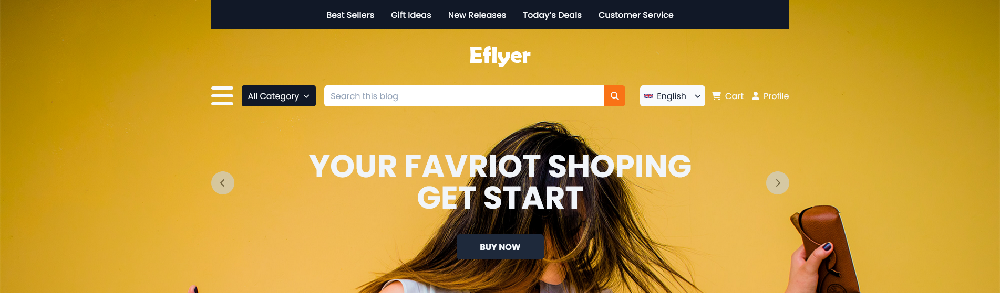
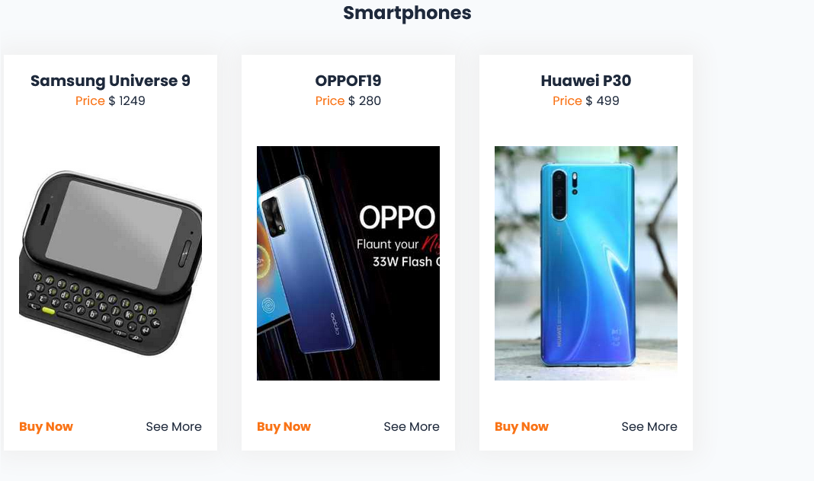
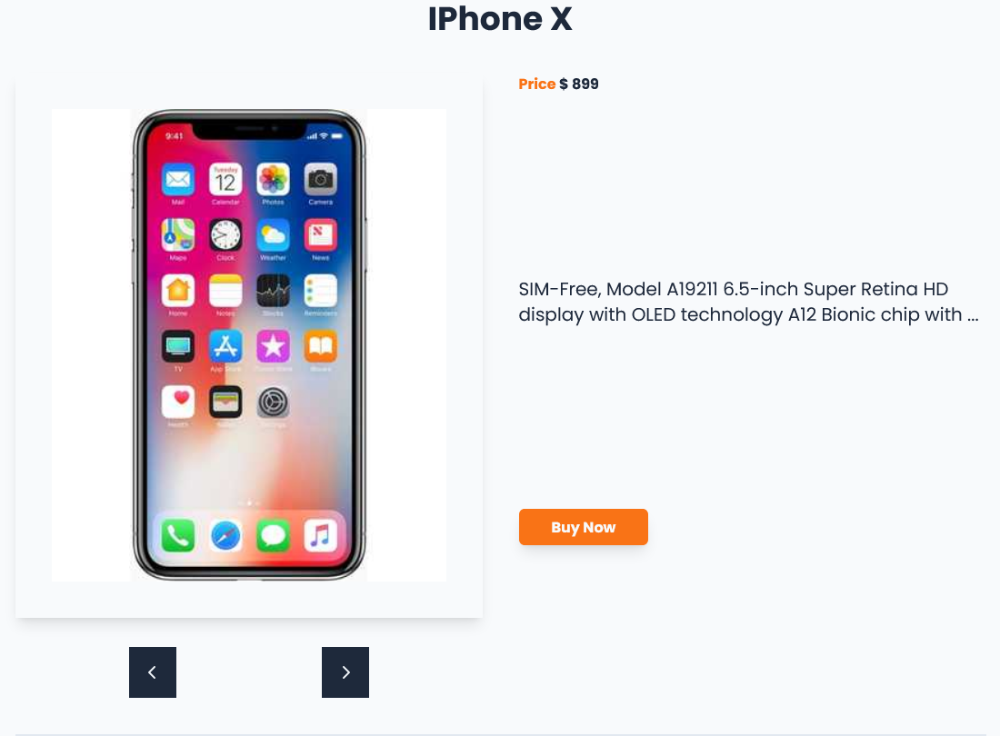
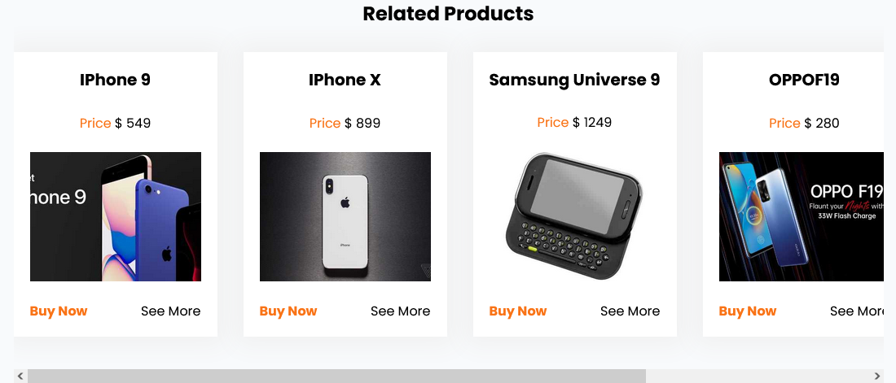
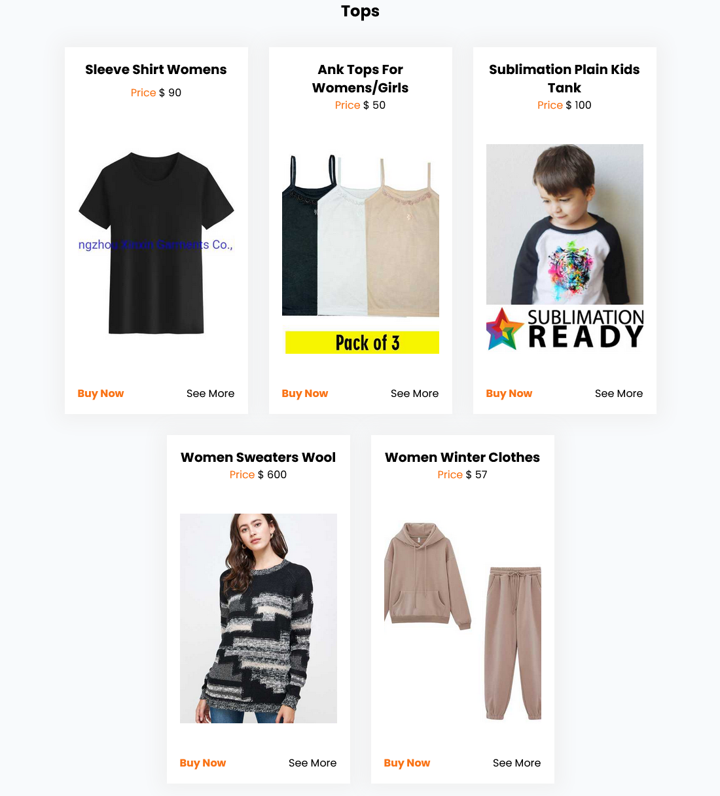

# Elflyer

Published on [Elflyer](https://steady-meerkat-2fe126.netlify.app/)

My first project where I have used both the css and js framework. For css framework I have applied Tailwindscss in the project and for js framework I have used Vue.js. In the project I have used some icons from fontawesome.

The website's design is borrowed from [Free Html Templates](https://html.design/download/eflyer-shopping-psd-template/). To retrieve the database for products displayed in the page, I have used [dummyJson](https://dummyjson.com). Unfortunately, the database only shows five products for each category. Only five products are displayed regardless of which category you choose.

I have made some changes to the design. For the most part, the appearance of the web page for mobile is quite different from the regular design.

- Used resources and methods to create the web page.
  - Tailwindcss
  - Vue.js
  - Fontawesome
  - Axios
  - Vue Pinia
  - Vue Router

There is much that can be improved in the project. Especially using Vue Pinia. But as my first Vue.js project I am satisfied with the results I achieved. Feel free to test the page and give constructive feedback. Thanks.

### Home Page Hero Section

### Home Page Section

### Singel Product Page

### Relevant Products Section

### Choosen Category Page

